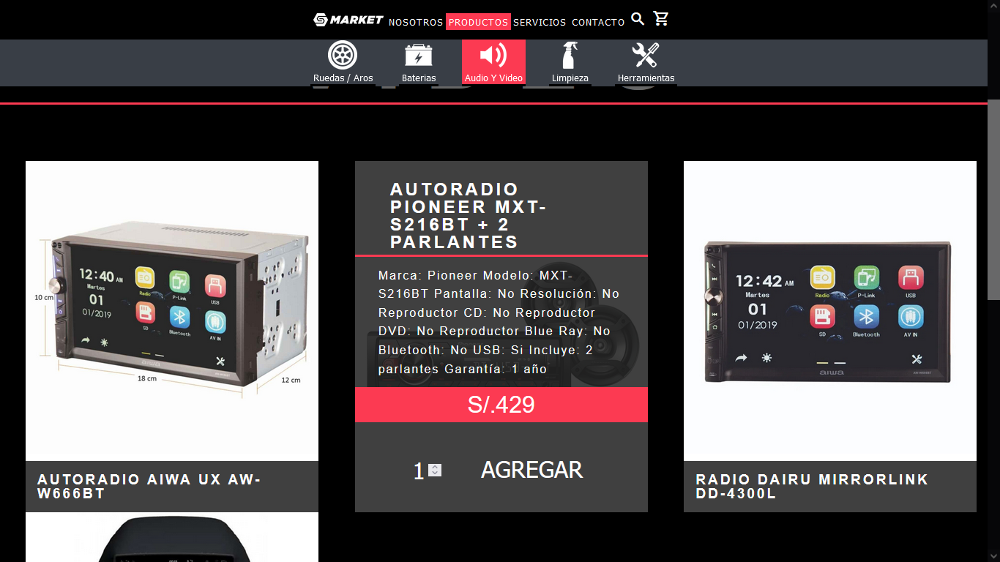
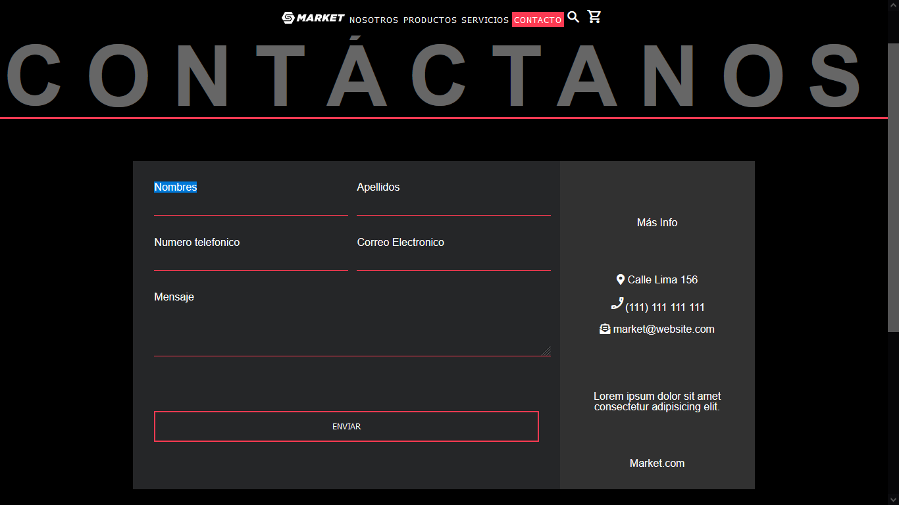
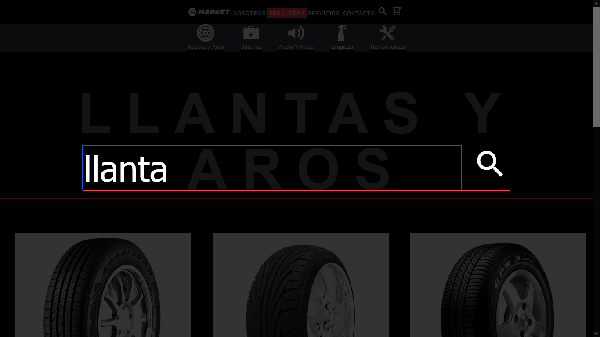

<div id="top"></div>
<!-- PROJECT LOGO -->
<br />
<div align="center">
    

  <h1 align="center">GLP-market⚡</h1>
  <p align="center">
    Ecommerce website implementando el framework laravel y el motor de bases de datos MariaDB.
    <br />
  </p>
</div>


<!-- TABLE OF CONTENTS -->
<details>
  <summary>Tabla de contenido</summary>
  <ol>
    <li><a href="#sobre-el-proyecto">Sobre el Proyecto</a></li>
    <li><a href="#construido-con">Construido con</a></li>
    <li><a href="#prerequisitos">Prerequisitos</a></li>
    <li><a href="#iniciar-localmente">Iniciar localmente</a></li>
    <li><a href="#screenshots">Screenshots</a></li>
  </ol>
</details>
<br>
<hr>

<!-- ABOUT THE PROJECT -->
## Sobre el proyecto

<div align="center">
    
</div>

Este proyecto se define como híbrido entre landing page y tienda virtual, nos centramos en el impacto visual y la estética de la página entregando un sistema con un carrito basando en cookies. Haciendo uso del motor de base de datos mysql.

<p align="right">(<a href="#top">ir al inicio</a>)</p>
<hr>

### Construido con
* [Laravel](https://laravel.com)
* [XAMPP](https://www.apachefriends.org/index.html)
* [mariaDB](https://www.apachefriends.org/index.html)
* [composer](https://getcomposer.org/)

<p align="right">(<a href="#top">ir al inicio</a>)</p>
<hr>

### Prerequisitos
* PHP 8.0.3 o mayor
* Se requiere tener instalado[Composer](https://getcomposer.org/)
* Se requiere tener instalado [XAMPP](https://www.apachefriends.org/index.html)
<hr>

### Iniciar localmente
1. Clonar el repositorio e ingresar a la carpeta respectiva
```
    git clone https://github.com/Jamir-boop/GLP-market
    cd ./GLP-market/
```
2. Duplicar el archivo `env.example` y renombrarlo a `.env`
3. En su terminal ejecutar las siguientes lineas para instalar dependencias con composer.
   ```she
   composer dump-autoload
   composer install
   ```
4. Abrar XAMPP e inicie el servidor Apache y el motor mysql.
5. En su navegador ingrese a la dirección `127.0.0.1/phpmyadmin`
6. Cree una base de datos con el nombre `gas-laravel`
7. Ejecute las migraciones
   ```sh
   php artisan migrate
   ```
8. Inicie el servidor local
   ```sh
   php artisan serve
   ```
<p align="right">(<a href="#top">ir al inicio</a>)</p>
<hr>

### Screenshots

<br>

<br>

<br>

<br>
